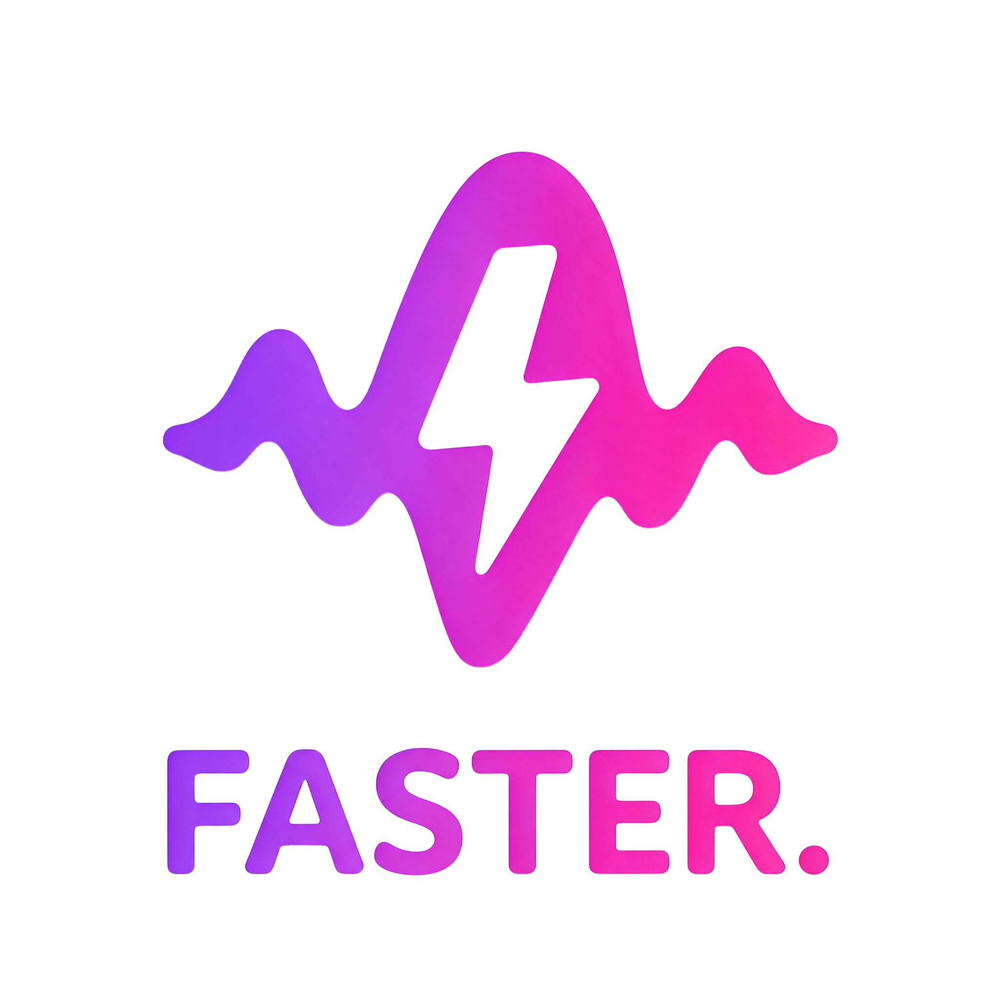

<div align="center">



# ⚡ FASTER.

### Speak. We'll keep up.

**A free, 100% offline voice-to-text workspace for Windows — with a neon cyberpunk soul.**
Press a hotkey (or just say *"Hey Faster"*), talk, and your words appear in **any** app.

<p>
  
  
  
  
  
  
  
</p>

[✨ Features](#-features) · [🚀 Quick start](#-quick-start) · [🎮 How to use](#-how-to-use) · [⚙️ Settings](#%EF%B8%8F-settings) · [📦 Build an .exe](#-build-your-own-exe) · [🛠 Troubleshooting](#-troubleshooting) · [🌍 Open source](#-open-source--contributing)

</div>

---

<!--
  📸 Add a screenshot or GIF of the app here, then uncomment the line below:
  
-->

## 💡 Why Faster?

Most dictation tools send your voice to the cloud, cost money, or lag behind your thoughts.
**Faster** runs a Whisper model *on your own PC*: no internet, no subscription, no data leaving your machine — just a clean space where your voice turns into text in seconds.

> 🔒 **Your voice never leaves your computer.** After the model is downloaded the first time, Faster works fully offline.

> 🌍 **100% open source (MIT).** Fork it, rewrite it, ship your own version — no permission needed. See [Open source & contributing](#-open-source--contributing).

---

## ✨ Features

### 🎙 Dictate anywhere
- **Global hotkeys** — `Ctrl + 1` to start, `Ctrl + 2` to stop (fully customizable).
- **Hands-free mode** — say **"Hey Faster"** to start and **"stop writing"** to finish.
- **Auto-paste** — your text is typed straight into whatever app you're using (Notepad, Word, Chrome, Discord…).
- **Live captions** — a rolling preview of what you're saying, while you say it.

### 🧠 Smart transcription
- Powered by **[faster-whisper](https://github.com/SYSTRAN/faster-whisper)** — fast, accurate, CPU-friendly.
- Choose your model: **tiny · base · small · medium**.
- **Auto-detect** the language, or lock one (English, Arabic, Spanish, French, German, Hindi, Urdu, Turkish and more).
- Optional **filler-word removal** ("um", "uh", "hmm") and **spoken formatting** (say *"new line"* or *"new paragraph"*).

### 🌌 A UI you'll actually enjoy
- Dark **cyberpunk / neon** design with glass cards, glowing borders and a drifting aurora background.
- **Animated waveform** that reacts to your voice, plus a scanner animation while transcribing.
- **4 neon accent themes** — Cyan Pulse, Neon Orchid, Emerald Grid, Solar Flare — switch live.
- Smooth hover glows, page fades, typewriter text reveal and slide-in notifications.

### 🗂 Your thoughts, organized
- **Session archive** that survives restarts — with **search**, **pinning ★**, copy, delete and one-click open.
- **Export** a transcript to `.txt` / `.md`, or your whole library to a single Markdown file.
- Live stats: words in transcript, last speaking pace (wpm), saved sessions.

### 🎛 Made to be tweaked
- Pick your **microphone**, accuracy (beam size), glow intensity, always-on-top, sound cues and more.
- Animated background can be switched off to save CPU.

---

## 🚀 Quick start

### 1. What you need

| Requirement | Details |
|---|---|
| 🪟 **Windows 10 / 11** | Faster is built and tested on Windows |
| 🐍 **Python 3.10 or newer** | [Download Python](https://www.python.org/downloads/) — during setup, tick **"Add Python to PATH"** |
| 📦 **pip** | Comes with Python. Check it with `pip --version` |
| 🌿 **Git** *(optional)* | [Download Git](https://git-scm.com/downloads) — or just use *Code → Download ZIP* on GitHub |
| 🎤 **A microphone** | Any input device Windows can see |
| 🌐 **Internet, once** | Only to download the Whisper model the first time |

Check that Python is ready (open **Command Prompt** or **PowerShell**):

```bash
python --version
pip --version
```

### 2. Get the code

```bash
git clone https://github.com/0rvd/Faster.git
cd Faster
```

*(No Git? Download the ZIP from GitHub, unzip it, and open a terminal inside the folder.)*

### 3. Install the libraries

**Option A — recommended (clean virtual environment):**

```bash
python -m venv .venv
.venv\Scripts\activate
python -m pip install --upgrade pip
pip install -r requirements.txt
```

**Option B — one line, no virtual environment:**

```bash
pip install PyQt6 numpy sounddevice keyboard pyperclip faster-whisper
```

**What each package does:**

| Package | Why Faster needs it |
|---|---|
| `PyQt6` | The neon user interface |
| `faster-whisper` | The offline speech-to-text engine (Whisper) |
| `sounddevice` | Records audio from your microphone |
| `numpy` | Audio math & waveform |
| `keyboard` | Global hotkeys and auto-paste into other apps |
| `pyperclip` | Copies the transcript to your clipboard |

### 4. Run it

```bash
python ui.py
```

> ⏳ **First launch:** Faster downloads the selected Whisper model once (the *base* model is ~150 MB). After that it works fully offline.

**Update later:** `git pull` then `pip install -r requirements.txt --upgrade`

---

## 🎮 How to use

1. **Click inside** the app where you want your words to appear (Notepad, Word, Chrome, Discord…).
2. Press **`Ctrl + 1`** — or say **"Hey Faster"** — and start talking.
3. Press **`Ctrl + 2`** — or say **"stop writing"** — and watch your text appear.

| Action | Shortcut / Command |
|---|---|
| Start recording | `Ctrl + 1` · say **"Hey Faster"** |
| Stop & paste | `Ctrl + 2` · say **"stop writing"** |
| Save transcript | `Ctrl + S` |
| New session | `Ctrl + N` |
| Fullscreen | `F11` (exit with `Esc`) |

Prefer not to type into other apps? Turn **Auto-paste** off — Faster keeps the text in its own workspace and copies it to your clipboard.

---

## ⚙️ Settings

Open **Settings** (⚙ in the top bar) to make Faster yours:

| Section | What you can change |
|---|---|
| 🎨 **Appearance** | Neon accent, animated background, glow intensity, always-on-top |
| 🎛 **Speech engine** | Model size, language, microphone, accuracy |
| ⚡ **Behaviour** | Auto-paste, append mode, voice commands, live captions, filler removal, spoken formatting, sound cues, global hotkeys |
| 🗂 **Data** | Export or clear your archive |

**Which model should I pick?**

| Model | Speed | Accuracy | Download (approx.) |
|---|---|---|---|
| `tiny` | ⚡⚡⚡⚡ | ★★ | ~75 MB |
| `base` | ⚡⚡⚡ | ★★★ | ~150 MB |
| `small` | ⚡⚡ | ★★★★ | ~480 MB |
| `medium` | ⚡ | ★★★★★ | ~1.5 GB |

---

## 📦 Build your own `.exe`

Want a double-click app you can share? Use [PyInstaller](https://pyinstaller.org):

```bash
pip install pyinstaller

pyinstaller --noconsole --onedir --name Faster ^
  --icon icon.ico ^
  --add-data "logo.png;." --add-data "icon.ico;." ^
  --collect-all faster_whisper --collect-all ctranslate2 ^
  ui.py
```

Your app will be in `dist/Faster/`. Zip it and share it 🎁

---

## 🪶 Lite version (no UI)

Just want the bare essentials? [`lite/main.py`](lite/main.py) is a tiny console version of Faster — about 60 lines, no window and no PyQt6. It's also a great way to learn how the app works, or a starting point for your own tool.

```bash
pip install numpy sounddevice keyboard pyperclip faster-whisper
python lite/main.py
```

| Key | What happens |
|---|---|
| `Ctrl + 1` | Start recording |
| `Ctrl + 2` | Stop, transcribe and paste into the active app |
| `Ctrl + C` *(in the terminal)* | Quit |

---

## 🛠 Troubleshooting

<details>
<summary><b>Hotkeys don't work</b></summary>

The `keyboard` library hooks the whole keyboard. If `Ctrl + 1` does nothing, run Faster **as administrator**, or change the hotkeys in *Settings → Behaviour → Global hotkeys*.
</details>

<details>
<summary><b>Nothing gets transcribed</b></summary>

- Check **Settings → Speech engine → Microphone** and pick the right input device, then click **Apply & reload engine**.
- Make sure Windows allows microphone access for desktop apps (*Settings → Privacy & security → Microphone*).
- Watch the waveform while you speak — if it stays flat, Faster can't hear your mic.
- Wait for the engine status in the sidebar to say **READY** (the first launch downloads the model).
</details>

<details>
<summary><b>It's slow</b></summary>

Pick a smaller model (`tiny` / `base`), lower the accuracy slider, and switch off the animated background and live captions.
</details>

<details>
<summary><b>The model won't download</b></summary>

The first run needs internet once to fetch the Whisper model. After that you can go fully offline.
</details>

<details>
<summary><b>"pip" or "python" is not recognized</b></summary>

Python isn't on your PATH. Re-run the Python installer, choose **Modify**, and tick **"Add Python to environment variables"** — or reinstall and tick **"Add Python to PATH"**. Then open a **new** terminal window. You can also try `py -m pip install -r requirements.txt`.
</details>

<details>
<summary><b>Install fails or a DLL error appears (ctranslate2 / faster-whisper)</b></summary>

Install the latest [Microsoft Visual C++ Redistributable](https://learn.microsoft.com/cpp/windows/latest-supported-vc-redist) and make sure you're using a 64-bit Python 3.10+. Then run `pip install --upgrade faster-whisper`.
</details>

---

## 🗺 Roadmap

- [x] Offline Whisper dictation with global hotkeys
- [x] Hands-free wake phrase
- [x] Neon cyberpunk UI with live waveform
- [x] Session archive with search, pins and export
- [ ] System-tray mode
- [ ] Custom wake phrase
- [ ] Auto-save sessions
- [ ] macOS / Linux support
- [ ] Custom vocabulary & text snippets

Got an idea? [Open an issue](../../issues) — suggestions are very welcome 💜

---

## 🗂 Project structure

```
Faster/
├── ui.py              # the whole app (UI + engine)
├── lite/
│   └── main.py        # tiny console version (hotkeys + auto-paste, no UI)
├── logo.png           # sidebar logo
├── icon.ico           # window / exe icon
├── requirements.txt   # Python dependencies
├── LICENSE            # MIT — free for everyone
└── README.md
```

Faster stores your data locally in your home folder:
`~/.faster_settings.json` (settings) and `~/.faster_sessions.json` (saved sessions).

---

## 🌍 Open source & contributing

**Faster is open source and always will be.** Take it, fork it, rename it, upgrade it, sell it, build something way cooler on top of it — I don't mind at all. That's the whole point. 💜

**How to make your own version:**

1. **Fork** this repo (the button at the top right of the page).
2. **Clone** your fork and create a branch: `git checkout -b my-cool-feature`
3. **Change anything** — the app lives in a single, well-commented file (`ui.py`), organised into numbered sections (theme, widgets, engine, pages, main window).
4. **Test it** with `python ui.py`.
5. **Share it** — open a Pull Request back here, or just publish your fork. Both are welcome!

**Ideas if you want to hack on it:**

- 🧲 System-tray mode & start-with-Windows
- 🗣 Custom wake phrase and voice commands
- 🔤 Custom vocabulary, snippets and text replacements
- 🍎 macOS / 🐧 Linux support
- 🌍 UI translations
- 🎨 New neon themes (add one line to `ACCENTS`!)
- ⚡ GPU / CUDA support for bigger models

Found a bug or have an idea? [Open an issue](../../issues) — every bit of feedback helps.

## 🙏 Credits

- [**faster-whisper**](https://github.com/SYSTRAN/faster-whisper) by SYSTRAN — the blazing-fast speech engine
- [**OpenAI Whisper**](https://github.com/openai/whisper) — the model behind it all
- [**PyQt6**](https://www.riverbankcomputing.com/software/pyqt/) — the UI toolkit
- [`sounddevice`](https://python-sounddevice.readthedocs.io/), [`keyboard`](https://github.com/boppreh/keyboard), [`pyperclip`](https://github.com/asweigart/pyperclip) and [`NumPy`](https://numpy.org/)

## 📄 License

Released under the **[MIT License](LICENSE)** — you're free to use, copy, modify, merge, publish, distribute and even sell this software. The only ask: keep the copyright and license notice in your copies.

---

<div align="center">

**Made with 💜, caffeine and a lot of talking.**

If Faster saves you time, drop a ⭐ — it makes my day!

</div>
